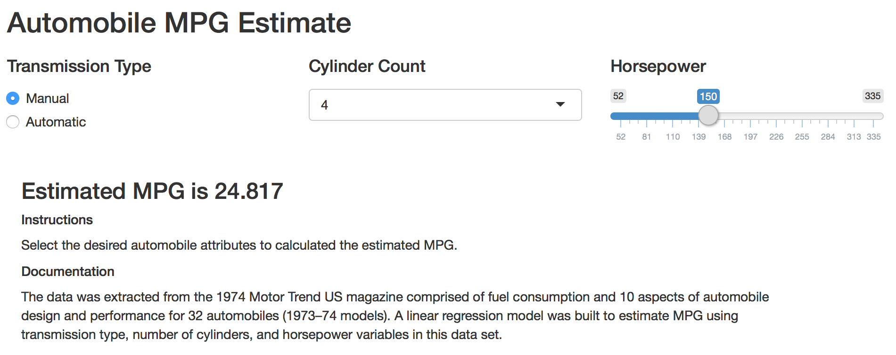

<!-- Limit image width and height -->
<style type="text/css">
img {     
  max-height: 560px;     
  max-width: 964px; 
}
</style>
 
<!-- Center image on slide -->
<script type="text/javascript" src="http://ajax.aspnetcdn.com/ajax/jQuery/jquery-1.7.min.js"></script>
<script type="text/javascript">
$(function() {     
  $("p:has(img)").addClass('centered'); 
});
</script>

```{r, echo= FALSE, cache= TRUE, message= FALSE, comment= NA, warning= FALSE}
library(shiny)
library(caret)
library(dplyr)
options(dplyr.width = Inf, dplyr.print_max = 1000)

#load mtcars data
data(mtcars)
```

## Overview

* The data was extracted from the 1974 Motor Trend US magazine comprised of 
fuel consumption and 10 aspects of automobile design and performance for 32 automobiles 
(1973–74 models).
* A linear regression model was built to estimate MPG using transmission 
type, number of cylinders, and horsepower variables in this data set.
* A Shiny App was created that allows users to input transmission type, number of cylinders, and horsepower and receive an estimate of MPG based on this model.

---

## Data
```{r, echo= FALSE, cache= TRUE, message= FALSE, comment= NA, warning= FALSE}
#create training data set
train_data <- mtcars %>% 
                  mutate(TransType = factor(ifelse(am == 1, 
                                                   'manual',
                                                   'automatic'))) %>%
                  mutate(CylinderCount = as.factor(cyl)) %>%
                  select(-am) %>%
                  select(Mpg = mpg,
                         CylinderCount,
                         Horsepower = hp,
                         TransType
                  )

summary(train_data)

str(train_data)
```

---

## Linear Regression Model
```{r, echo= TRUE, cache= TRUE, message= FALSE, comment= NA, warning= FALSE}
#train linear model
trainlm1_model <- train(Mpg ~ CylinderCount + Horsepower + TransType,
                        data = train_data,
                        method = 'lm'
)
```

```{r, echo= FALSE, cache= TRUE, message= FALSE, comment= NA, warning= FALSE}
#linear model coefficients
round(trainlm1_model$finalModel$coefficients, 3)
```

---

## Shiny App



