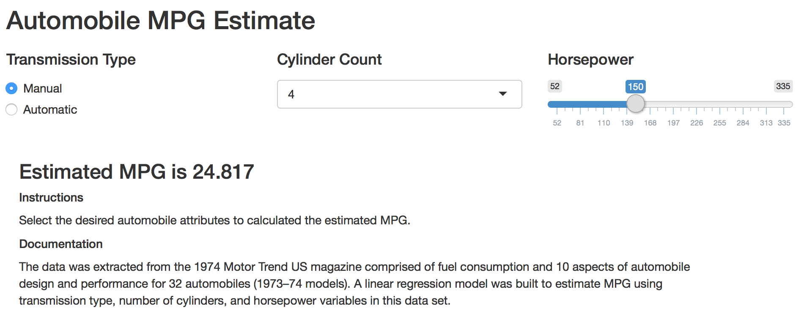

<!-- Limit image width and height -->
<style type="text/css">
img {     
  max-height: 560px;     
  max-width: 964px; 
}
</style>
 
<!-- Center image on slide -->
<script type="text/javascript" src="http://ajax.aspnetcdn.com/ajax/jQuery/jquery-1.7.min.js"></script>
<script type="text/javascript">
$(function() {     
  $("p:has(img)").addClass('centered'); 
});
</script>


## Overview

* The data was extracted from the 1974 Motor Trend US magazine comprised of 
fuel consumption and 10 aspects of automobile design and performance for 32 automobiles 
(1973–74 models).
* A linear regression model was built to estimate MPG using transmission 
type, number of cylinders, and horsepower variables in this data set.
* A Shiny App was created that allows users to input transmission type, number of cylinders, and horsepower and receive an estimate of MPG based on this model.

---

## Data

```
      Mpg        CylinderCount   Horsepower        TransType 
 Min.   :10.40   4:11          Min.   : 52.0   automatic:19  
 1st Qu.:15.43   6: 7          1st Qu.: 96.5   manual   :13  
 Median :19.20   8:14          Median :123.0                 
 Mean   :20.09                 Mean   :146.7                 
 3rd Qu.:22.80                 3rd Qu.:180.0                 
 Max.   :33.90                 Max.   :335.0                 
```

```
'data.frame':	32 obs. of  4 variables:
 $ Mpg          : num  21 21 22.8 21.4 18.7 18.1 14.3 24.4 22.8 19.2 ...
 $ CylinderCount: Factor w/ 3 levels "4","6","8": 2 2 1 2 3 2 3 1 1 2 ...
 $ Horsepower   : num  110 110 93 110 175 105 245 62 95 123 ...
 $ TransType    : Factor w/ 2 levels "automatic","manual": 2 2 2 1 1 1 1 1 1 1 ...
```

---

## Linear Regression Model

```r
#train linear model
trainlm1_model <- train(Mpg ~ CylinderCount + Horsepower + TransType,
                        data = train_data,
                        method = 'lm'
)
```


```
    (Intercept)  CylinderCount6  CylinderCount8      Horsepower 
         27.296          -3.925          -3.533          -0.044 
TransTypemanual 
          4.158 
```

---

## Shiny App



